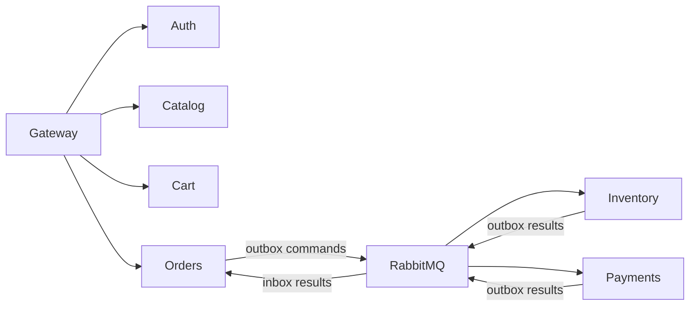

# E-Commerce Backend — Microservices Architecture

A production-oriented e-commerce backend built with **Node.js** and designed to demonstrate real-world backend engineering practices, including microservices architecture, authentication and authorization, asynchronous event-driven workflows, transactional outbox, inventory reservations, idempotency, retries, dead-letter queues, structured logging, Docker, and Kubernetes.

The system is composed of independently deployable services with database-per-service isolation and a unified API Gateway.

---

## Architecture



Catalog owns product metadata and Elasticsearch search. Inventory owns its PostgreSQL stock and reservation database. Payments owns payments and refunds. Orders coordinates the Saga through the durable `app.events` direct exchange. Cart uses Redis; Gateway preserves Auth0 authentication.

See [Phase 2 contracts, states, tests and recovery](docs/phase2.md).

# Authentication and Authorization

The application uses **Auth0** for the primary authentication and authorization flow.

The architecture separates identity management from the application's local user data.

```text
Browser
   │
   │ GET /login
   ▼
Gateway
   │
   │ Auth0 Authorization Code Flow
   ▼
Auth0
   │
   │ callback
   ▼
GET /callback
   │
   │ access token
   ▼
HttpOnly Cookie
   │
   ▼
Protected API requests
```

## Auth0 configuration

The Auth0 API is configured with:

* RS256 signing
* API audience
* RBAC
* API permissions

Services validate Auth0 access tokens independently rather than trusting authentication performed only by the gateway.

Authorization is enforced using permissions such as:

```text
read:products
write:products
```

and service-specific order permissions.

## Auth0 login routes

The gateway exposes:

```text
GET /login
GET /callback
GET /health
```

`/login` starts the Auth0 authorization flow.

`/callback` handles the Auth0 authorization response, exchanges the authorization code for tokens, and stores the access token in an HttpOnly cookie.

Protected services independently validate the Auth0 JWT and resolve the authenticated user to the application's local user record.

---

# API Gateway

The API Gateway provides a single entry point for clients.

```text
Client
  |
  v
Gateway :8080
  |
  +--> Auth Service
  +--> Catalog Service
  +--> Cart Service
  +--> Orders Service
```

Responsibilities include:

* Authentication entry point
* Auth0 login flow
* Request routing
* Rate limiting
* Request ID propagation
* Service-to-service forwarding
* Centralized API entry point
* Health endpoint

The gateway's rate limiter is currently process-local. A production multi-replica deployment would use a shared store such as Redis for distributed rate limiting.

---

# Communication Model

The system uses two communication patterns.

## Synchronous communication

Used when an immediate response is required.

Examples:

```text
Gateway → Catalog Service
Gateway → Cart Service
Gateway → Orders Service
Gateway → Auth Service
Payments Service → Catalog Service
Orders Service → Auth Service
```

HTTP request IDs are propagated between services to improve traceability.

## Asynchronous communication

RabbitMQ is used for operations that can be processed independently.

```text
Orders Service
      |
      | order_placed
      v
RabbitMQ
      |
      v
Payments Service
```

Payment completion and refund completion are also published as events.

---

# Order and Payment Workflow

Success follows PENDING → STOCK_RESERVED → PAYMENT_AUTHORIZED → CONFIRMED. Failed payment waits for inventory compensation; paid cancellation waits for refund and inactive inventory verification. See [Phase 2](docs/phase2.md).

# Transactional Outbox

The system uses the transactional outbox pattern to prevent database updates and event publishing from becoming inconsistent.

Instead of performing:

```text
UPDATE database
     +
publish RabbitMQ event
```

inside the same application operation, the service performs:

```text
BEGIN TRANSACTION

INSERT business record
INSERT outbox event

COMMIT
```

A background poller later publishes the outbox event to RabbitMQ.

```text
Service
  |
  +--> PostgreSQL
  |       |
  |       +--> Business record
  |       +--> Outbox event
  |
  v
Outbox Poller
  |
  v
RabbitMQ
```

The outbox event is marked as published only after successful message publishing.

This provides reliable event delivery even if RabbitMQ is temporarily unavailable.

---

# RabbitMQ

RabbitMQ uses a durable direct exchange:

```text
app.events
```

Events are routed using routing keys.

Current event types include:

```text
order_placed
payment_processed
refund_requested
refund_processed
```

The architecture uses dedicated application users rather than relying on the RabbitMQ default `guest` account.

The Docker Compose RabbitMQ bootstrap/default credentials are separate from the dedicated service users used by Orders and Payments.

The services use:

```text
orders_app
payments_app
```

with permissions scoped to the exchange and queues required by each service.

This avoids giving application services unnecessary access to the RabbitMQ broker.

---

# RabbitMQ Reliability

Message processing uses:

* Durable queues
* Durable exchange
* Confirm channels
* Explicit acknowledgements
* Retry handling
* Dead-letter queues
* Reconnection handling
* Idempotent consumers

The current processing configuration retries transient failures before moving a message to a dead-letter queue.

The consumer supports up to three processing retries with a configurable retry delay.

RabbitMQ connection recovery also uses a reconnect delay.

Dead-letter queues include:

```text
order_placed_dlq
payment_processed_dlq
refund_requested_dlq
refund_processed_dlq
```

This prevents repeatedly failing messages from blocking normal event processing.

---

# Idempotency

Distributed systems can deliver the same event more than once.

The payment workflow therefore uses idempotency checks to avoid duplicate side effects.

Payment processing uses database-backed records to identify already processed orders.

Refund processing uses the same approach for refund requests.

The system also uses PostgreSQL advisory locks to serialize operations that must not run concurrently for the same order.

This protects against scenarios such as:

```text
duplicate order event
        +
duplicate payment processing
```

or:

```text
two refund requests
        +
same order
```

---

# Inventory Management

Inventory Service exclusively owns available stock, reservations, expiration and restoration. Order advisory locks serialize confirmation, expiration and release. Payments does not call inventory APIs. See [Phase 2](docs/phase2.md).

# Payments

The Payments Service is responsible for:

* Payment processing
* Refund processing
* Payment idempotency
* Refund idempotency
* Inventory coordination
* Payment events
* Refund events
* Transactional outbox
* Retry handling
* Dead-letter handling

Payment results are persisted before the corresponding outbox event is published.

---

# Redis Cart Service

The Cart Service uses Redis for shopping-cart storage.

The cart workflow also validates product information against the Catalog Service.

```text
Client
  |
  v
Cart Service
  |
  +--> Redis
  |
  +--> Catalog Service
```

Redis provides fast access to frequently modified cart data without introducing another relational database for cart state.

---

# Elasticsearch

Elasticsearch is used by the Catalog Service for product search.

The search implementation supports fuzzy matching and allows users to search product information without requiring exact string matches.

Elasticsearch is also used as part of the structured logging infrastructure.

---

# Structured Logging

The services use structured logging instead of relying only on plain text console output.

Logs include contextual information such as:

* Service
* Request ID
* Event type
* Order ID
* User information where appropriate
* Error details
* Processing status

Request IDs are propagated across service boundaries to make distributed request tracing easier.

---

# Error Handling and Reliability

The services implement multiple reliability mechanisms.

## Retries

Transient failures can be retried.

Examples include:

* HTTP 408
* HTTP 429
* HTTP 5xx
* transient PostgreSQL failures
* temporary network failures

Permanent failures are not retried indefinitely.

## Dead-letter queues

Messages that continue to fail after the configured retry attempts are moved to a DLQ.

This keeps the main event queues available for healthy traffic.

## Reconnection

RabbitMQ consumers automatically attempt to reconnect when the broker connection is lost.

## Database locking

PostgreSQL advisory locks and row-level locking are used where concurrent operations could otherwise produce duplicate or conflicting state transitions.

---

# Database Isolation

Each service owns its own database.

```text
Auth Service
    |
    +--> auth_db

Catalog Service
    |
    +--> catalog_db

Orders Service
    |
    +--> orders_db

Payments Service
    |
    +--> payments_db
```

Services do not directly access another service's database.

Cross-service operations happen through:

* HTTP APIs
* RabbitMQ events

This maintains service ownership boundaries.

---

# Docker Compose

The complete system can be run locally with Docker Compose.

## Start the system

```bash
docker compose up -d --build
```

## Check service status

```bash
docker compose ps
```

## Follow logs

```bash
docker compose logs -f gateway
```

Examples:

```bash
docker compose logs -f orders-service
docker compose logs -f payments-service
docker compose logs -f catalog-service
```

## Stop the system

```bash
docker compose down
```

Persistent volumes can be removed when a complete local reset is required:

```bash
docker compose down -v
```

---

# Environment Variables

Secrets are supplied through environment files and Docker/Kubernetes Secrets.

Important configuration includes:

```text
AUTH0_DOMAIN
AUTH0_AUDIENCE
AUTH0_CLIENT_ID
AUTH0_CLIENT_SECRET
AUTH0_CALLBACK_URL

JWT_CURRENT_SECRET
JWT_PREVIOUS_SECRET

RABBITMQ credentials

Database credentials

INTERNAL_SERVICE_KEY

RETRY_DELAY_MS

RESERVATION_EXPIRATION_MINUTES
INVENTORY_EXPIRATION_INTERVAL_MS
```

Actual secret values should never be committed to Git.

The repository uses `.gitignore` rules for local `.env` files.

---

# Kubernetes

The application also includes Kubernetes manifests for local deployment.

Major Kubernetes resources include:

```text
auth-db
auth-service

catalog-db
catalog-service

redis
cart-service

orders-db
orders-service

payments-db
payments-service

rabbitmq
elasticsearch

gateway
```

The manifests configure:

* Deployments
* Services
* PersistentVolumeClaims
* Secrets
* Resource requests
* Resource limits
* Liveness probes
* Readiness probes
* Security contexts

---

# Kubernetes Security

The application containers are configured with Kubernetes security hardening such as:

* Non-root execution
* Dropped Linux capabilities
* RuntimeDefault seccomp profile
* Resource limits
* Health probes
* Secret-based configuration

Database and messaging state uses persistent volumes where required.

The current Kubernetes setup is intended for local development and demonstration rather than a highly available production cluster.

---

# Kubernetes Deployment

Start Docker Desktop Kubernetes and deploy the manifests from the Kubernetes directory.

Example:

```bash
kubectl apply -f k8s/
```

Check workloads:

```bash
kubectl get pods
```

Check services:

```bash
kubectl get services
```

Check deployments:

```bash
kubectl get deployments
```

Inspect a service:

```bash
kubectl describe deployment gateway
```

View logs:

```bash
kubectl logs deployment/gateway
```

---

# Testing

The project has automated Jest and Supertest coverage across all six services.

Current baseline:

| Service          | Test Suites | Tests |
| ---------------- | ----------: | ----: |
| Gateway          |           1 |     5 |
| Auth Service     |           5 |    32 |
| Catalog Service  |           4 |    41 |
| Cart Service     |           3 |     9 |
| Orders Service   |           3 |    36 |
| Payments Service |           5 |    32 |
| Total            |          21 |   155 |

Current baseline result:

```text
21 test suites passed
155 tests passed
```

Run the complete test suite:

```bash
for service in gateway auth-service catalog-service cart-service orders-service payments-service; do
  echo ""
  echo "========== $service =========="
  (cd "$service" && npm test -- --runInBand)
done
```

---

# CI

The project includes automated CI for the Node.js services.

The CI pipeline verifies the application using:

* Node.js
* npm
* Service dependencies
* Automated test suites

This helps prevent regressions before changes are merged.

---

# Security

Security controls currently implemented include:

* Auth0 authentication
* Auth0 RBAC
* Permission-based authorization
* Independent JWT validation in services
* HttpOnly authentication cookie
* Internal service authentication
* Dedicated RabbitMQ application users
* Scoped RabbitMQ permissions
* Secret-based configuration
* Request validation
* Rate limiting
* Database advisory locks
* Idempotent payment processing
* Idempotent refund processing
* Non-root Kubernetes containers
* Dropped Linux capabilities
* Kubernetes security contexts
* Health and readiness probes

The repository still contains some legacy JWT configuration for compatibility and test infrastructure. Auth0 is the primary authentication flow.

---

# Project Structure

```text
ecommerce-backend/
│
├── gateway/
│   ├── src/
│   ├── tests/
│   └── package.json
│
├── auth-service/
│   ├── src/
│   ├── tests/
│   └── package.json
│
├── catalog-service/
│   ├── src/
│   ├── tests/
│   └── package.json
│
├── cart-service/
│   ├── src/
│   ├── tests/
│   └── package.json
│
├── orders-service/
│   ├── src/
│   ├── tests/
│   └── package.json
│
├── payments-service/
│   ├── src/
│   ├── tests/
│   └── package.json
│
├── k8s/
│   ├── auth-db.yaml
│   ├── auth-service.yaml
│   ├── catalog-db.yaml
│   ├── catalog-service.yaml
│   ├── cart-service.yaml
│   ├── orders-db.yaml
│   ├── orders-service.yaml
│   ├── payments-db.yaml
│   ├── payments-service.yaml
│   ├── rabbitmq.yaml
│   ├── redis.yaml
│   ├── elasticsearch.yaml
│   └── gateway.yaml
│
├── docker-compose.yml
└── README.md
```

---

# Design Patterns Demonstrated

This project intentionally demonstrates several backend engineering patterns.

## Microservices

Each major business capability is independently deployable.

## Database per Service

Each service owns its persistence layer.

## API Gateway

Clients interact with one public entry point.

## Transactional Outbox

Database changes and event publication are coordinated reliably.

## Event-Driven Architecture

RabbitMQ decouples order, payment, and refund workflows.

## Idempotency

Repeated events do not create duplicate payment or refund side effects.

## Distributed Locking

PostgreSQL advisory locks protect concurrent order operations.

## Retry and DLQ

Transient failures are retried while permanently failing messages are isolated.

## Inventory Reservation

Stock is reserved before successful payment completion and restored when required.

## Health Checks

Services expose health/readiness information for container orchestration.

---

# Current Limitations

The current project is designed primarily as a local development and portfolio system.

Some production-scale concerns remain outside the current scope.

### Kubernetes High Availability

The current Kubernetes environment uses a local cluster with single-instance stateful dependencies.

A production deployment would require appropriate high-availability designs for:

* PostgreSQL
* RabbitMQ
* Elasticsearch
* Redis

### Distributed Rate Limiting

The gateway currently uses an in-memory rate limiter.

A multi-replica production deployment would require a shared rate-limiting store such as Redis.

### Secret Management

Local development uses environment variables and Kubernetes Secrets.

A production environment would normally use a dedicated secret-management system.

### Observability

The project has structured logging and request IDs.

A production deployment could additionally introduce:

* Metrics
* Distributed tracing
* Centralized dashboards
* Alerting
* OpenTelemetry-based tracing

---

# Future Improvements

Potential future work includes:

* Highly available RabbitMQ
* Production-grade PostgreSQL replication
* Redis high availability
* Elasticsearch cluster deployment
* Distributed gateway rate limiting
* Centralized secret management
* OpenTelemetry tracing
* Prometheus metrics
* Grafana dashboards
* Automated deployment pipelines
* Cloud deployment
* Horizontal pod autoscaling
* More comprehensive load testing
* Contract testing between services

---

# Example End-to-End Flow

Orders creates an order and a reservation command atomically. Inventory reserves stock and emits inventory_reserved. Orders requests payment, handles payment_processed, requests inventory confirmation and completes only after inventory_confirmed. Compensation uses refunds and release verification. See [Phase 2](docs/phase2.md).

# Engineering Goals

This project is intended to demonstrate practical backend engineering concepts rather than simply CRUD functionality.

The implementation focuses on:

```text
Service Isolation
       +
Authentication
       +
Authorization
       +
Reliable Messaging
       +
Transactional Consistency
       +
Idempotency
       +
Concurrency Control
       +
Inventory Consistency
       +
Failure Recovery
       +
Containerization
       +
Kubernetes
       +
Automated Testing
```

The resulting system provides a realistic foundation for studying and demonstrating backend development, distributed systems, reliability engineering, and microservices architecture.


## License

This project is intended for learning, portfolio demonstration, and backend engineering practice.
