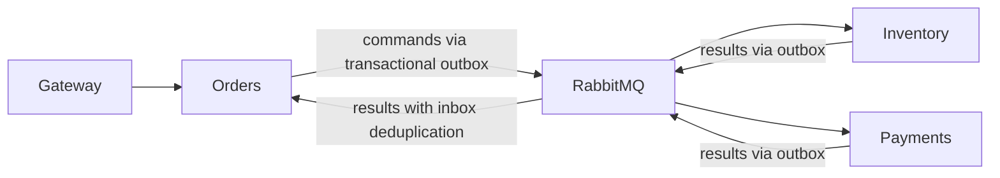

# Phase 2 Saga and recovery

Orders owns orchestration; Inventory owns reservations and available stock; Payments owns the local payment/refund simulator. Auth0 and internal service authentication remain in place.



## States

- Success: PENDING → STOCK_RESERVED → PAYMENT_AUTHORIZED → CONFIRMED.
- Insufficient stock: record STOCK_FAILED in transition history, then CANCELLED in the same transaction; no payment command.
- Payment failure: record PAYMENT_FAILED, then RELEASE_PENDING; inventory verification completes CANCELLED.
- Cancellation before reservation: CANCEL_REQUESTED waits for the reservation outcome and compensates it. Cancellation with a payment command in flight waits for the payment result.
- Paid cancellation or expiration: REFUND_PENDING → RELEASE_PENDING → CANCELLED. Inventory verification is required even when expiration already restored stock; inactive release does not increment stock.
- Failed refund: REFUND_FAILED. An explicit cancellation retry generates a new command event, with the same payment operation identity. No successful refund is repeated.

Every transition, inbox insertion, order update, history record, and outgoing command commits together. Inventory uses an order advisory lock across reserve/confirm/release/expiration and checks the deadline before confirmation. Release writes a closed-operation tombstone, preventing later reservation after a reordered cancellation.

## Event contracts

All new events carry eventId and orderId. Order commands also carry userId, amount (decimal string), items, requestId, operationId and attempt. Orders obtains financial fields from its own persisted order, rather than trusting inventory results.

| Routing key | Owner | Result |
| --- | --- | --- |
| inventory_reserve_requested | Inventory | inventory_reserved or inventory_reservation_failed |
| payment_requested | Payments | payment_processed: succeeded or failed |
| inventory_confirm_requested | Inventory | inventory_confirmed or inventory_confirmation_failed |
| inventory_release_requested | Inventory | inventory_released, including verification of already inactive or absent reservations |
| refund_requested | Payments | refund_processed: refunded or failed |
| inventory_expired | Inventory | Order-level expiration with allInactive flag and affected reservations |

A persisted result's event ID remains stable across publication retries. Legacy payment/refund/expiration events receive deterministic fallback IDs at the Orders consumer. Legacy expiration events are not interpreted as proof that all reservations are inactive.

Consumers acknowledge only after database commit, or after confirmed DLQ publication. Technical failures have three attempts; malformed JSON is sent directly to the durable matching DLQ. Closing a failed connection leaves unacknowledged messages for broker redelivery. Shutdown cancels subscriptions and waits for active callbacks.

Outboxes use mandatory routing, publisher confirms and at-least-once delivery; returned unroutable messages remain unpublished for retry. Saga timeout reconciliation replays the existing operation/event ID at most three times, then records a manual-reconciliation error; it never infers that a payment failed from elapsed time. Owners republish persisted results on duplicate commands.

## Isolated tests

Database modules reject test mode unless DB_NAME_TEST ends in `_test` and differs from DB_NAME. `prepare-test-databases.js` copies schema only into three new `*_phase2_test` databases and refuses to replace an existing database. The local integration harness is explicitly opted into by `run-tests.js`. Ordinary per-service CI tests do not execute the local cross-service harness.

```sh
node scripts/phase2/prepare-test-databases.js
node scripts/phase2/run-tests.js orders
node scripts/phase2/run-tests.js inventory
node scripts/phase2/run-tests.js payments
```

Do not run historical destructive tests with development database credentials or names. The test harness truncates only isolated test tables.

## Order 56: approval-gated recovery

Verified: persisted payment succeeded for 20.00; no refund; Saga PAYMENT_AUTHORIZED; reservation EXPIRED and an inventory_expired outbox row exists. Expiration restores stock in the same transaction as the EXPIRED transition. The existing confirmation command is queued; it must never convert the expired reservation back to active stock.

The default `node scripts/phase2/recover-order-56.js` is read-only. It validates payment ownership/amount, inactive reservations, expiration evidence, refund history and Saga state. `--execute` requires explicit user approval.

After approval:

1. Pause Orders and Payments workers during migration and recovery initialization (`docker compose stop orders-service payments-service`). Preserve all queues and messages.
2. Run `node scripts/phase2/apply-migrations.js` to apply Orders 002, Inventory 001 and Payments 001 transactionally with migration tracking; do not rerun historical schema creation. Grant app roles only access to their new tables/sequences.
3. Run `node scripts/phase2/extend-orders-permissions.js` to extend orders_app permissions with inventory_expired, inventory_confirmation_failed and their DLQs, keeping existing scoped permissions. Declare/bind the new result queues before restarting publishers.
4. Build the three modified service images (`docker compose build orders-service inventory-service payments-service`). Commit the verified-expiration recovery event using `recover-order-56.js --execute` while workers are paused. This atomically enters REFUND_PENDING and writes exactly one refund command; no reservation or payment request is created.
5. Start rebuilt Payments and Orders (`docker compose up -d --no-deps payments-service orders-service`), then recreate only Inventory with the corrected credential (`docker compose up -d --no-deps --force-recreate inventory-service`). Verify subscriptions to its three command queues. The queued old confirmation reads inactive status and emits an explicit failure without any confirmation UPDATE. Its result cannot interrupt a refund already in progress.
6. Verify one persisted successful refund, then inventory_released verification. Only then does Orders enter CANCELLED. The EXPIRED reservation stays EXPIRED and no stock increment occurs.
7. Repeat read-only verification after a service restart. Leave malformed payment_requested DLQ messages untouched.

If any precondition changes, stop and reconcile. Never reserve stock or charge again to complete order 56. A failed refund remains REFUND_FAILED and requires an explicit reviewed retry.

## Limits

Payments currently uses an in-process simulator, not a real provider. Tests select PAYMENT_OUTCOME and REFUND_OUTCOME deterministically; FORCE_PAYMENT_FAILURE remains supported. A future external provider must persist operation identity and use orderId/operationId as its provider idempotency key before performing network side effects. These tests cannot establish real-world refund settlement.

Broker reconnect tests use mocked AMQP transport; database integration drives the actual persisted outboxes directly. A full Docker/RabbitMQ restart E2E run remains necessary after approval-gated rollout. New result queues require scoped permissions before rollout. Secrets remain local and uncommitted.

## Restricted-role refund permission repair

The live refund upsert failed because `payments_app` had SELECT/INSERT but no UPDATE privilege. PostgreSQL checks the UPDATE branch of `INSERT ... ON CONFLICT DO UPDATE` even for a first insertion. Migration `payments-service/migrations/002_operation_update_permissions.sql` grants only column-level UPDATE on `status` and `updated_at` for payments/refunds. Amount and ownership updates remain forbidden; sequence USAGE was already present.

`node scripts/phase2/apply-payment-permissions.js` tracks the idempotent production migration; `--test` applies it only to payments_phase2_test. Runtime verification uses EXPLAIN under payments_app without executing the upsert, modifying records, or advancing sequences. Actual inserts/upserts and rollback are tested only in isolated databases.

The local test runner now authenticates as orders_app and payments_app. Production grants are mirrored into isolated test databases by `mirror-test-grants.js`. Separate privileged fixture pools perform only isolated setup/cleanup; application code never receives those pools. Inventory currently uses its existing inventory_user role. The optional restricted-role integration tests remain local-harness tests, not ordinary CI execution.

Current order 56 checkpoint: REFUND_PENDING / refund_pending, one successful payment for 20.00, zero refunds, original refund_requested event 56:refund_requested:1 published, one message in refund_requested_dlq, EXPIRED reservation quantity 2 and available stock 10. Orders and Payments remain stopped. The permission migration is applied; no second refund command has been created.

### DLQ inspection constraint and next controlled step

The available RabbitMQ Basic.Get/management-fetch APIs deliver a message even when it is left unacknowledged. They do not satisfy a strict requirement to inspect its body without consuming/delivering it. Queue counts alone cannot prove that the DLQ message belongs to order 56. No message has been fetched or replayed at this checkpoint.

A safe, specifically authorized recovery would hold only one DLQ message unacknowledged, validate its exact eventId, operationId, orderId, amount and userId against persisted outbox event 60 and the successful payment, and reject any mismatch. It would need narrowly scoped DLQ read access for the recovery client. While workers remain paused, verify there is no successful refund and no other command for the operation. Replay the identical validated payload with its original IDs and publisher confirmation; keep the original unacknowledged until the persisted refund and Saga completion are verified. Only then acknowledge the original. A failed or interrupted recovery closes its connection, allowing broker-managed redelivery of that held message. Never blindly requeue or purge a DLQ.

Do not run recover-order-56.js --execute again to create another command. Future recovery must use the original operation/event identity. Live E2E and restart validation remain pending successful completion of this checkpoint.

## Logging compatibility repair

The historical logs index dynamically mapped meta.eventId as long; Inventory outbox row IDs were logged numerically. No current index template matches the bare logs index. Its 15,305 historical documents remain accessible.

Updated applications normalize identifiers to strings and write through ecommerce-logs-write to ecommerce-logs-v2-000001. The ecommerce-logs-v2 template explicitly maps eventId, orderId, requestId, operationId, correlationId and other identifier fields as keyword. Its default ingest pipeline also converts legacy numeric identifiers to strings. ecommerce-logs-history reads both old and new indices. Aggregations across historical numeric fields and new keyword fields still require type-aware queries; old mappings were not modified.

Seven synthetic documents verified the actual Orders, Inventory and Payments structured logging pipeline and raw numeric ingest conversion. No identifiers in Saga messages or database business records were changed. Logger source is updated across services; the three Phase 2 service images have the repair, while unrelated running service images still use their previous logging configuration until their next rollout.

## Restricted-role repair and completed recovery (2026-10-09)

The refund upsert failed because `payments_app` lacked UPDATE privileges, despite successful owner-based integration tests. Tracked Payments migration `002_operation_update_permissions.sql` grants only UPDATE on `status` and `updated_at` for payments/refunds; existing sequence USAGE permissions were verified separately. Integration application connections now use restricted roles against isolated `*_phase2_test` databases, with privileged fixture management kept separate. All 121 tests passed (Orders 64, Inventory 34, Payments 23), including rollback, retry, operation identity and duplicate-refund cases.

The authorized `scripts/phase2/replay-refund-56.js` fetched one DLQ delivery with manual acknowledgement, compared the complete payload with the sole persisted refund command and rechecked database preconditions. It temporarily extended only Payments DLQ read permission, then restored the original permissions. The identical event `56:refund_requested:1` and operation `56:refund_requested` were republished with mandatory routing and publisher confirms. The original delivery stayed unacknowledged until refund persistence, result publication/consumption and final inventory verification were confirmed.

Final persisted state: order cancelled, Saga CANCELLED (version 7); exactly one succeeded payment and one refunded simulated refund for 20.00, both owned by user 22. History records REFUND_PENDING → RELEASE_PENDING → CANCELLED. The original refund outbox command remains the sole refund command and is published. The compensation release command is published. Reservation remains EXPIRED, quantity 2; product 1 available stock remains 10. The original DLQ message was then acknowledged.

All three services were restarted and these invariants remained unchanged. Required queues each had one consumer, zero ready messages and zero unacknowledged deliveries. `refund_requested_dlq` was empty; historical `payment_requested_dlq` (1) and `order_placed_dlq` (2) were preserved. Seven synthetic Elasticsearch records verified string and legacy numeric identifier compatibility; 15,305 historical log records remained accessible. No structured service error entries were observed during recovery/restart.

This is live Docker/RabbitMQ verification of the actual approved compensation and restart. The isolated database suites verify duplicate command behavior; a separate isolated live-broker E2E/redelivery suite has not been run. Refunds remain simulated, and real provider settlement/idempotency cannot be established by these tests. Saga last_error retains the earlier expired-reservation explanation even after cancellation.

## Final isolated live RabbitMQ validation (2026-10-09)

Run `node scripts/phase2/live-rabbitmq-tests.js` explicitly to exercise the actual application consumers, stores and outbox pollers in test-only worker processes against the live Docker RabbitMQ broker. The harness uses a unique `phase2_live_test_*` vhost and user restricted to that vhost. Credentials are generated in memory and never printed. Application database connections use restricted roles and the three exact `*_phase2_test` databases; privileged fixture setup first checks each database name. It never connects to development databases or the `/` broker vhost. Test fixtures are reset only inside those isolated databases. Workers additionally reject non-test database/vhost configuration.

Successful run: `phase2_live_test_1791559757609`, synthetic order 1, user/product 900001. All seven requested behaviors passed:

- Repeated payment commands persisted exactly one payment.
- Repeated refund commands persisted exactly one successful refund.
- SIGKILL after payment commit and before consumer acknowledgement caused actual RabbitMQ redelivery, observed via its redelivered flag; replay used the same event identity and created no second payment.
- Repeated reservation commands reduced stock only once (10 → 8); repeated release commands restored it only once (8 → 10).
- A test-only exception after publisher confirmation but before updating the outbox published flag forced real outbox republication. Orders recorded only one PAYMENT_AUTHORIZED transition and one CONFIRMED transition.
- Restarting all three test worker processes preserved CANCELLED and the transition count.
- Injected technical failures in payment/refund processing each attempted exactly three times and delivered the unchanged payload to its matching durable DLQ. Inspection used manual acknowledgement and returned both synthetic DLQ deliveries to their test queues.

After workers stopped, every test queue had zero unacknowledged deliveries and zero consumers. All ordinary test queues were empty; only `payment_requested_dlq` and `refund_requested_dlq` each retained one synthetic failure. The test vhost, queues and fixtures were retained without purging or deletion. No order 56, development database, runtime queue or historical DLQ access was made during this validation.

Limitations: these are isolated Node service-worker restarts using production consumers/pollers, not Docker container or broker restarts. Fault injection is confined to the test worker and simulates a technical processing failure and the publish-confirm/update crash window. Live bounded-retry checks cover Payments' two command queues; existing transport tests cover the other consumers. Real provider operations and settlement remain outside the local simulator's guarantees. This run completes the previously outstanding isolated live-broker redelivery/idempotency validation.

## Phase 2.1 — Stage A: canonical migrations (implementation only)

Added Orders and Payments `000_initial_schema.sql` baselines matching the established test schema. Historical SQL migrations remain unchanged. The new explicit test manifest orders all four services' migrations, including Payments permission migration 002 and both Catalog 001 filenames. These baselines are for empty databases; do not replay them on existing installations.

`test-support/migration-runner.js` exports `migrateTestDatabase(client, {service, database, provenanceToken})`. It has no CLI or connection side effects. The caller supplies an exclusive PostgreSQL client. The runner validates the actual connected database, requires a `_test` target, locks migration execution for the database, validates the complete applied-history prefix and SHA-256 checksums, and applies each SQL migration and tracking record transactionally. Migration SQL uses the public schema explicitly through transaction-local search_path. A failed migration rolls back, leaving earlier committed migrations available for a safe retry. Existing untracked application schemas and incompatible migration history are rejected rather than adopted.

Stage B must create `public.phase21_test_provenance` only when creating a new empty test database, before running migrations. Required columns are `singleton` (a unique TRUE row), `service`, `database_oid` (matching pg_database.oid), `token` (nonempty random provisioner token), and `origin` (`created-empty-test`). This metadata and `schema_migrations(position, filename, checksum, applied_at)` must remain administrative-only. Stage A does not create provenance, roles, databases, or grants. Catalog 003 requires matching persisted fresh-test provenance AND explicit `authorizedFreshTest` in the manifest. No adoption of historical development data is supported.

Run the network-free orchestration checks with `node --test scripts/phase2/tests/provisioning.test.js`. Stage A verification: 18 passed, zero failures. These checks use a fake query client; PostgreSQL syntax, actual transactional DDL, lock serialization and role permissions require isolated Stage B validation. Payments migration 002 requires payments_app to exist; Stage B must provision that role separately before migrations. Existing test/provisioning/CI entry points are unchanged pending the subsequent stages. No existing database or broker resources were accessed during Stage A.

## Phase 2.1 — Stage B: dedicated PostgreSQL provisioning

Stage B replaces development-schema copying with canonical provisioning in `docker-compose.test.yml` only. Start/provision with `node scripts/phase2/prepare-test-databases.js --start`; rerun without `--start` to verify/apply missing tracked migrations. This creates no connections to development databases and never drops or replaces a database. The project is `ecommerce-phase21-test`; containers are `<project>-<service>-test-db-1`, and each uses its own `<project>_<service>-test-data` named volume. Ports bind only to 127.0.0.1: Orders 55435, Payments 55436, Inventory 55437, Catalog 55438. The dedicated bridge network is `<project>_test-postgres-access`. An unused internal test network from the initial setup attempt was retained; no development network or volume was reused.

Configuration is generated independently of development `.env` in an owner-only OS temporary directory named `ecommerce-phase21-test-<repository-path-hash>`. Administrative and application passwords are independently generated and never printed. Compose mounts administrative passwords as files rather than command arguments. Preserve this private directory while retaining the volumes: losing it intentionally causes authentication failure rather than automatic credential reset. It must not be committed or copied into application environments. Stage C will wire only application credentials into test workers and expose administrative credentials only to fixture helpers.

Provisioning verifies Compose project/service labels, exact data-volume names and localhost port mappings before opening PostgreSQL connections. Roles are provisioned separately, before application migrations, with no schema ownership, role memberships, SUPERUSER, CREATEDB, CREATEROLE, replication or BYPASSRLS. Existing roles are verified and never have their passwords reset. Database creation and provenance initialization are serialized; existing unmarked databases are rejected instead of adopted. Payments role `payments_app` therefore exists before migration 002. Marker and migration-history tables remain administrative-only. Catalog 003 was applied exclusively to the newly created empty Catalog test database, after verifying its provenance and explicit manifest authorization.

Databases/roles: `orders_phase21_test`/`orders_app`, `inventory_phase21_test`/`inventory_app`, `payments_phase21_test`/`payments_app`, `catalog_phase21_test`/`catalog_app`. Explicit test grants are in `test-support/test-grants.sql`. Applications receive SELECT/INSERT on their operational tables, USAGE on required sequences, and UPDATE only on columns their existing SQL modifies. Payments status/updated_at UPDATE grants come from canonical migration 002. Unnecessary Orders sequence SELECT inherited from historical migration 002 is revoked in the test grant layer. Applications cannot DELETE/TRUNCATE tables, create schemas/tables, own application relations, or read provenance/migration metadata. `mirror-test-grants.js` remains as a compatibility entry point but now applies this explicit grant definition only to the dedicated test stack, without reading development grants.

Stage B verification: `PHASE21_POSTGRES=true node --test scripts/phase2/tests/provisioning.test.js` passed 26/26 (18 orchestration tests and 8 actual PostgreSQL checks), twice, with the final run also checking forbidden DELETE/database CREATE/sequence SELECT. Canonical migrations applied: Orders 3, Inventory 2, Payments 3, Catalog 5. Repeat provisioning skipped all 13 migrations without replacing schemas or resetting roles. Restricted-role connections executed representative application SQL, including payment/refund insert and idempotent upsert, inventory writes, Orders Saga writes and Catalog inserts. Test data was rolled back, leaving zero business rows in the four primary test databases.

A synthetic tracking-insert failure proved actual baseline DDL and tracking rollback, successful retry, and lock retention during both SQL execution and tracking insertion. Separate migration sessions were observed to serialize. Unsafe targets, bad provenance and checksum mismatches were rejected without tracking changes. Two fresh diagnostic databases, `payments_probe_1791561428956_test` and `payments_probe_1791561553949_test`, were retained in the dedicated Payments instance; no databases or volumes were deleted.

Setup failures resolved: the initial internal network did not publish host ports, so it was replaced in the test Compose definition by a dedicated bridge network while retaining data volumes; PostgreSQL role-format parameters then required explicit text casts. Both failures stopped provisioning rather than using development resources. No test assertions were weakened. Stage C/D, the existing 121-test suite against these new targets, and live RabbitMQ wiring are intentionally pending. Production business logic and historical migrations remain unchanged.

## Deferred Stage E — Kubernetes operational tooling

Inventory entry: `scripts/create-k8s-secrets.js`, classification GENERALIZE, high execution risk. Preserve this script unchanged throughout Stages C and D. Stage E must align all Secret names/keys with current Kubernetes manifests (including orders-app-db-secret and Auth0 configuration); separate restricted database application credentials; pin explicit Kubernetes context and namespace on every command; transport secret input securely without values in command arguments/logs; separate bootstrap from rotation; implement preflight checks, dry-run, explicit confirmation and partial-failure recovery; and verify required Secrets exist before workload deployment.

Read-only audit: the script creates/updates 12 Secret resources sequentially, supports Inventory and restricted RabbitMQ service URLs, but omits orders-app-db-secret and Auth0 configuration. Inventory/Catalog reuse database bootstrap credentials for applications. It checks docker-desktop only once and inherits namespace/context for later operations. It passes literals in process arguments and inherits kubectl errors; these can expose secret-bearing information. A repeat run can generate new shared keys unintentionally. It neither provisions database roles/broker permissions nor rotates persisted database/broker passwords. It depends on Node built-ins, an interactive terminal, kubectl and kubeconfig. No Kubernetes commands or Secret access occurred during this audit; Stage E remains deferred.

## Phase 2.1 — Stage C: application test integration

The runner now resolves repository/service paths independently of cwd and uses shared test configuration only. Applications receive an application-only owner-protected configuration file; administrative credentials are loaded by provisioning and privileged fixture helpers only. Database connections verify current_database/current_user before use. Fixture operations verify administrative identity on the same acquired client before executing setup/cleanup SQL. Application connections verify the configured restricted role before statements. Test dotenv mocks prevent development configuration loading. Explicit synthetic Auth0/internal-auth values replace local developer configuration in tests.

Inventory/Catalog fixture cleanup now uses guarded administrative connections; Orders and Payments existing fixture helpers use the same explicit isolated infrastructure. Expiration deadline manipulation is fixture work and uses the admin helper, retaining the application's narrower UPDATE permissions. No application grants were broadened. Assertion/scenario preservation includes the original 121 tests, plus all 14 Catalog tests. Setup and teardown changes close Catalog clients rather than suppressing its open-handle warning.

Catalog's existing tests require actual search/index assertions. A dedicated catalog-test-es container and ecommerce-phase21-test_catalog-test-es-data volume were added on localhost 59200. The runner verifies its project, volume and published-port identity before Catalog cleanup/index operations. No development Elasticsearch index was used. The live RabbitMQ suite still creates a unique test vhost/user on the local broker; its application workers receive only application database credentials, verify role/database identity, and preserve all previous fault injection. Test queues/DLQs and synthetic data remain retained.

Verification: Orders 64/64, Inventory 34/34, Payments 23/23 (121 total); Catalog 14/14. Network-free orchestration/runner tests 21/21, including spawn error, signal and nonzero exit handling. Live suite passed in phase2_live_test_1791562313384 against orders_phase21_test, inventory_phase21_test and payments_phase21_test: one payment, one refund, stock 10, terminal CANCELLED; its two synthetic failure DLQs each retained one message. Kubernetes script and production source files remained unchanged. Stage D CI wiring is not started, so current CI does not yet provide this new configuration. Use the isolated runner rather than legacy manual environment settings. Existing PostgreSQL diagnostic databases, test broker resources and all volumes remain intact.

Additional Stage C check: the Orders runner was invoked by absolute path with cwd=/private/tmp and passed 64/64, confirming that neither repository-root cwd nor developer .env loading is required. Ordinary test fixture cleanup after this check changes synthetic database data as intended; the recorded live-suite state above describes its successful verification point. Test broker resources remain retained.

## Phase 2.1 — Stage D: GitHub Actions integration

CI now has four jobs: auth-service, database-integration, cart-service and gateway. Authentication, Cart and Gateway job coverage and service setup remain unchanged; checkout credential persistence is disabled and workflow permissions are limited to contents:read. The new database-integration job installs the four database-service dependency sets with npm ci, starts the dedicated docker-compose.test.yml stack using the canonical provisioner, and runs PostgreSQL migration/permission checks plus runner failure-handling checks. It then runs Orders, Payments, Inventory and Catalog sequentially through the isolated restricted-role runner. Sequential execution avoids cross-service fixture races. Catalog uses the dedicated health-checked test Elasticsearch instance; no development endpoints or volumes are configured.

PHASE2_INTEGRATION is explicitly enabled and the runner also sets it for application workers. Jest JSON reports must show success, no pending tests, all ten existing Saga integration cases, and all six restricted Payments cases passed. Missing, skipped or failed integration coverage fails the workflow. Legacy inline schema definitions for these four services were removed. The Auth job retains its existing ephemeral CI-only schema setup; extending Auth provisioning is outside this Phase 2.1 scope.

No repository secret is required by the database job: generated test credentials stay in owner-protected temporary files, administrative values are limited to provisioning/fixture helpers, and worker environment construction exposes application credentials only. Reports are stored in RUNNER_TEMP without uploading private configuration or container inspection artifacts. There are no continue-on-error settings, deployment steps, Kubernetes commands, automatic recovery scripts, or volume/database deletion commands. Live RabbitMQ fault injection remains an explicitly invoked optional local suite and is not a required GitHub Actions gate.

Local Stage D verification: YAML parsed successfully, all command/cache paths exist, all 17 shell blocks passed bash syntax checks, package manifests match lockfiles and installed direct dependencies verified. Auth/Cart/Gateway jobs were compared with their prior definitions and differed only in checkout credential persistence. Actual isolated tests passed: 29 provisioning/runner checks (including eight real PostgreSQL checks), Orders 64, Payments 23, Inventory 34, Catalog 14. The exact workflow report-verification code passed against local --ci Jest results and rejected three synthetic negative cases: skipped coverage, missing integration suite and failed report. No development infrastructure or Kubernetes resources were accessed.

These are local validations, not a GitHub-hosted execution. Fresh npm downloads, Actions execution, Linux Docker secret mounts/permissions, Elasticsearch startup timing and hosted-runner availability remain to be verified on the first CI run. The database job uses a 25-minute timeout and startup health checks. Repository branch-protection rules may need their required status names updated because four former service jobs are now represented by Restricted-role database and Saga integration. No commits or pushes were made; Stage E remains deferred.
